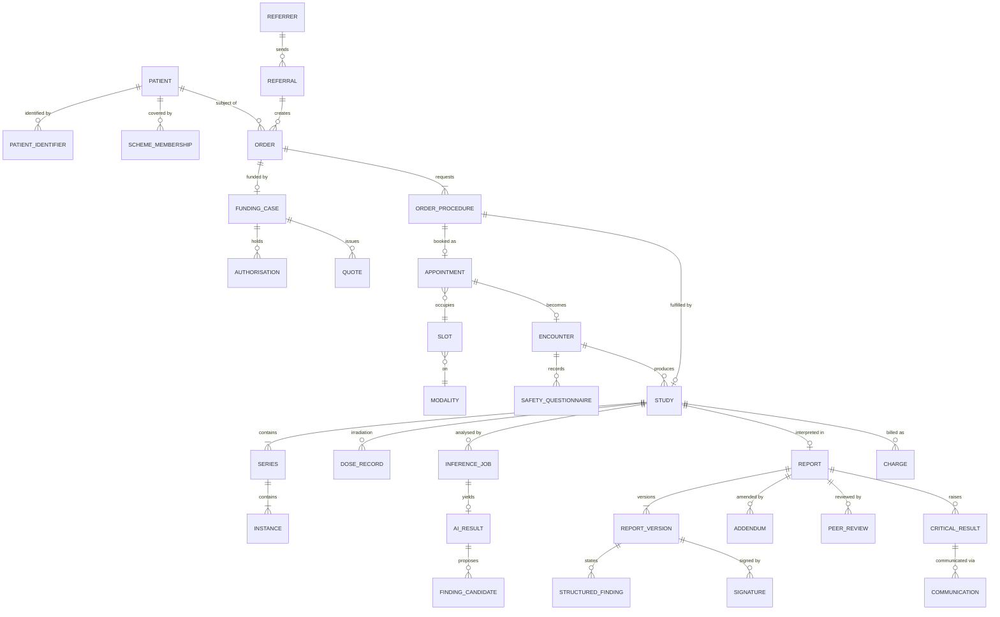
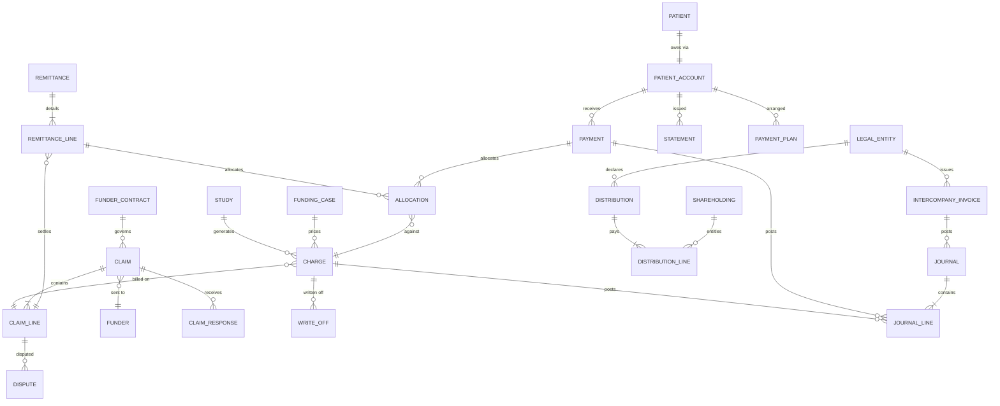

# 08 — Domain Model and Data

This document is the logical data model of the Bonakala Platform: the aggregates each module
(M01–M21) owns, their key fields, relationships and lifecycles, the domain event catalogue, the
reference data the Platform depends on, and the de-identification and retention rules. The
physical schema (`packages/db`, Drizzle) is generated from this model; where they differ, this
document wins.

## 1. Modelling conventions

| Convention | Rule |
|---|---|
| Identifiers | ULID primary key `id` on every row. Natural keys (SA ID number, accession number, practice number) are attributes with unique indexes, never primary keys. |
| Tenancy | Every clinical, financial and operational row carries `practice_id`; Group and MSO tables carry `group_id`. Row-level security is on by default (07 §4). |
| Time | `timestamptz` in UTC, displayed SAST. Effective-dated rows carry `effective_from`/`effective_to`. Financial rows carry `period_id` (Practice financial year and month). |
| Money | `amount_cents` as 64-bit integer ZAR cents plus `vat_cents` where VAT applies. Never floating point. |
| Versioning | Signed documents (reports, quotes, statements, policies) are immutable; changes create a new version linked by `supersedes_id`. |
| Deletion | Clinical and financial rows are never physically deleted inside their retention class; `status = voided` with a reason is the only path. POPIA erasure is handled by §7, not deletion. |
| Audit | Every write on a governed table (marked `[A]`) writes an `audit_log` entry (§3.21). |
| State machines | Lifecycle tables carry `status`, `status_changed_at`, `status_changed_by`. Transitions outside the allowed set are rejected by the domain layer. |
| Events | Every transition emits a versioned event into `outbox` in the same transaction (§5). |
| Provenance | Any field that may be AI-produced has a sibling `*_provenance_id` pointing to `ai_provenance`. |

Requirements:

* M21-R-100 Every table listed in this document MUST carry `id`, `created_at`, `created_by`, `updated_at`, `updated_by`; tenant tables MUST carry `practice_id`.
* M21-R-101 The Platform MUST reject any state transition not listed in the lifecycle tables of this document and MUST record the rejected attempt in `audit_log`.
* M21-R-102 Money MUST be stored as integer cents; any API that returns money MUST return cents and a display string, never a float.

## 2. Clinical core: Entity–Relationship overview

## 3. Module models and lifecycles

### 3.1 M01 Identity & Access

| Table | Key fields | Relationships |
|---|---|---|
| `user` [A] | id, type (staff, patient, referrer, funder, service, hand), primary_email, mobile_e164, display_name, preferred_language, mfa_state, status | staff users link to `staff_member`; patient users link to `patient` |
| `role_assignment` [A] | user_id, role (persona code + role name), scope_type (group, practice, site, hub), scope_id, effective_from/to, granted_by | ABAC attributes resolved from scope |
| `credential_verification` [A] | user_id, register (HPCSA, SAHPRA RPO, BHF), registration_no, category (radiologist, radiographer, sonographer), verified_at, verified_by (Hand or person), source_snapshot_file_id, next_check_at, status (pending, verified, lapsed, failed) | drives `M17 credential` |
| `session` | user_id, device_fingerprint, ip, lens, window_level, expires_at, revoked_at | |
| `consent` [A] | subject_type (patient, staff, shareholder), subject_id, purpose (treatment, sharing_with_referrer, results_via_whatsapp, marketing, research_deidentified, demographic_classification), lawful_basis (POPIA s.11 consent, s.11(1)(c) legal obligation, s.11(1)(d) legitimate interest), channel, granted_at, withdrawn_at, evidence_file_id, version_of_notice | referenced by M13 before any message is sent |
| `break_glass` [A] | user_id, patient_id, reason_code, free_text, opened_at, closed_at, reviewed_by, outcome | emits `access.break_glass.opened.v1` |

Consent lifecycle: `requested → granted → withdrawn`; `requested → declined`; `granted → expired` (notice version superseded, re-consent requested). Only the subject (or guardian) grants or withdraws; the Platform expires.

### 3.2 M02 Organisation & Shareholding

The tables are defined in 03 §3.1 and are not repeated. Two additions this document requires:

| Table | Key fields |
|---|---|
| `accession_prefix` [A] | legal_entity_id (practice), prefix (4 chars), allocated_at, retired_at, sequence_scope (practice), last_sequence_by_year (JSON) |
| `data_sharing_basis` [A] | from_entity, to_entity, purpose (billing bureau operator, reading services, group analytics), lawful_basis, agreement_id, effective_from/to |

### 3.3 M03 Patient Master Index

| Table | Key fields | Relationships |
|---|---|---|
| `patient` [A] | id, **epid** (enterprise patient id, 12-digit with check digit, national scope), given_names, surname, previous_surnames, date_of_birth, sex_at_birth, gender, deceased_at, preferred_language, preferred_channel, guardian_patient_id, verification_status, duplicate_score_last, retention_class | one per person across all practices; `patient_local_id` per practice |
| `patient_identifier` [A] | patient_id, type (sa_id, passport, refugee_permit, asylum_permit, birth_cert, scheme_member_dependant, hospital_mrn, raf_claim_no, coida_claim_no, odmwa_no, legacy_pms_id), value (encrypted), issuer (country, scheme code, hospital code), valid_from/to, verification_status (unverified, format_valid, document_seen, dha_verified, scheme_verified), verified_at, evidence_file_id | unique on (type, issuer, value) where active |
| `patient_local_id` | patient_id, practice_id, local_mrn, source_system, active | the id a legacy PACS/RIS used; retained for prior fetch |
| `patient_contact` [A] | patient_id, type (mobile, whatsapp, email, postal, next_of_kin), value, verified_at, is_primary, do_not_contact | |
| `scheme_membership` [A] | patient_id, scheme_id (ref: scheme master), plan_option, membership_no, dependant_code, principal_member_patient_id, status (active, suspended, lapsed, unknown), last_verified_at, verification_source | one active per scheme |
| `patient_link` | patient_id, linked_patient_id, type (guardian, next_of_kin, principal_member, twin_flag) | |
| `merge_case` [A] | survivor_patient_id, merged_patient_id, match_score, match_features (JSON), proposed_by (Hand, user), decided_by, decision (merge, keep_separate), decided_at, reversible_until | emits `patient.merged.v1`; all child rows re-pointed with a `merge_case_id` trail |

Patient identity verification lifecycle:

| State | Allowed transitions | Trigger |
|---|---|---|
| `unverified` | → `format_valid` | Platform validates SA ID checksum (Luhn) and date-of-birth/sex consistency, or passport MRZ (A4) |
| `format_valid` | → `document_seen`, → `dha_verified` | FDK scans ID (A1); a DHA/third-party verification service returns a match (A3, Identity Hand) |
| `document_seen` | → `dha_verified`, → `disputed` | as above; mismatch reported |
| `dha_verified` | → `disputed` | fraud or identity-theft report (CMP) |
| `disputed` | → `document_seen`, → `blocked` | CMP decision |

Duplicate detection runs at every registration and nightly (probabilistic match on ID number, surname phonetics, DOB, mobile, scheme number). Merges above 0.98 score with an exact ID match run at A3 with reversal window; all others queue for FDK/PRM at A1.

### 3.4 M04 Referral & Orders

| Table | Key fields | Relationships |
|---|---|---|
| `referrer` [A] | id, type (individual, organisation), name, discipline, hpcsa_no, bhf_practice_no, organisation_referrer_id, addresses, delivery_preferences (JSON: channel per result class), portal_user_id, status (prospect, active, dormant, blocked), churn_risk_score | organisation ↔ individuals |
| `referrer_identifier` | referrer_id, type (hpcsa, bhf_practice, pms_id, fhir_practitioner_id), value | |
| `referral` [A] | id, patient_id (nullable until matched), referrer_id, channel (portal, fhir, hl7_orm, whatsapp, email, fax, paper_scan, walk_in), received_at, source_file_id, extraction_provenance_id, clinical_question, icd10_suggested, urgency (routine, urgent, stat), status | one referral may create several orders |
| `order` [A] | id, referral_id, patient_id, practice_id, ordering_referrer_id, clinical_indication, icd10_codes[], pregnancy_status, priority, funding_case_id, status | |
| `order_procedure` | order_id, procedure_code (ref: procedure catalogue), laterality, contrast_flag, protocol_id, sequence, status mirrors order | one row = one billable study |
| `appropriateness_check` | order_procedure_id, guideline_set, score (appropriate, may_be_appropriate, usually_not), alternative_procedure_code, provenance_id, referrer_response | shown to REF at order time |

Order lifecycle:

| State | Allowed transitions | Trigger |
|---|---|---|
| `received` | → `matched`, → `needs_info`, → `rejected` | Intake Hand matches patient and referrer (A3); missing fields |
| `needs_info` | → `matched`, → `cancelled` | REF/BKG supplies info; 14-day timeout cancels with notice |
| `matched` | → `placed` | procedures coded, appropriateness reviewed |
| `placed` | → `scheduled`, → `cancelled` | appointment created (M05) |
| `scheduled` | → `in_progress`, → `cancelled`, → `placed` | encounter check-in; cancellation; reschedule releases back |
| `in_progress` | → `completed`, → `abandoned` | all order procedures reach `study.available`; patient could not complete |
| `completed` | → `reported` | report signed |
| `reported` | terminal (addenda do not change state) | |

### 3.5 M05 Scheduling & Capacity

| Table | Key fields | Relationships |
|---|---|---|
| `resource_calendar` | resource_type (modality, room, staff, mobile_unit), resource_id, template (weekly rules), exceptions (public holidays, maintenance, load-shedding windows), slot_length_rules by procedure group | |
| `slot` | resource_id, starts_at, ends_at, capacity, procedure_groups_allowed[], hold_token, hold_expires_at, status (open, held, booked, blocked) | Durable Object / advisory lock on hold |
| `appointment` [A] | id, order_procedure_id, patient_id, site_id, slot_id, modality_id, starts_at, duration_min, booked_via (patient_space, whatsapp, bkg, ref_portal, hand), preparation_instructions_version, arrival_instructions, no_show_risk_score, status | |
| `waitlist_entry` | order_procedure_id, earliest_at, latest_at, preferred_sites[], preferred_hours, priority, offered_slot_ids[], status (waiting, offered, accepted, expired) | |
| `reminder` | appointment_id, channel, scheduled_at, sent_at, response (confirmed, reschedule_requested, cancelled, none) | delivered via M13 |

Appointment lifecycle:

| State | Allowed transitions | Trigger |
|---|---|---|
| `tentative` | → `booked`, → `released` | slot held while funding is checked; 15-minute hold (illustrative, configurable) |
| `booked` | → `confirmed`, → `rescheduled`, → `cancelled`, → `no_show` | reminder response; patient/BKG action; 30 min past start with no arrival (Attendance Hand marks A3) |
| `confirmed` | → `arrived`, → `rescheduled`, → `cancelled`, → `no_show` | check-in (M07) |
| `arrived` | → `completed`, → `abandoned` | encounter reaches `discharged`; patient leaves before study |
| `rescheduled` | terminal; new appointment row links `rescheduled_from_id` | |
| `cancelled`, `no_show`, `completed`, `abandoned` | terminal | |

### 3.6 M06 Funding & Authorisation

| Table | Key fields | Relationships |
|---|---|---|
| `funder` | id, type (medical_scheme, administrator, raf, compensation_fund, corporate, government, cash), scheme_master_id, switch_payer_code, contact endpoints, portal/API capability flags | ref data for schemes |
| `funder_contract` [A] | funder_id, practice_id (or group-level), type (dsp, network, tariff_agreement, capitation), tariff_basis (scheme rate, % of reference tariff, negotiated schedule), rule_pack_version, effective_from/to, documents | drives pricing in M14 |
| `funding_case` [A] | id, order_id, patient_id, funder_type, primary_funder_id, secondary_funder_id, scheme_membership_id, raf_claim_no / coida_claim_no / employer_ref, liability_split (JSON: scheme portion, patient portion, third-party portion), status | one per order |
| `benefit_check` | funding_case_id, performed_at, method (api, switch, phone, portal), benefit_type (PMB, day-to-day, savings, hospital, radiology sub-limit), available_cents, response_raw_id, provenance_id | |
| `authorisation` [A] | funding_case_id, procedure_codes[], icd10_codes[], funder_ref_no, requested_at, decided_at, valid_from/to, approved_units, conditions, status (not_required, pending, approved, partial, declined, expired, appealed) | |
| `quote` [A] | funding_case_id, version, lines (tariff code, units, tariff_cents, scheme_cents, patient_cents), total_patient_cents, valid_until, guarantee_flag, issued_via, accepted_at, accepted_by | immutable; new version supersedes |

Funding case lifecycle:

| State | Allowed transitions | Trigger |
|---|---|---|
| `draft` | → `checking` | order placed |
| `checking` | → `quoted`, → `auth_required`, → `cash` | Funding Hand runs benefit check (A3) |
| `auth_required` | → `auth_pending`, → `cash` | Funding Hand submits auth (A3) or patient elects cash |
| `auth_pending` | → `quoted`, → `declined`, → `appeal` | funder response; 48-hour SLA timer escalates to BIL |
| `declined` | → `appeal`, → `cash`, → `cancelled` | RGT clinical motivation (A1) |
| `appeal` | → `quoted`, → `declined` | |
| `quoted` | → `accepted`, → `expired` | patient accepts in Patient Space or at desk |
| `accepted`, `cash` | → `settled_at_pos`, → `billable` | payment or encounter completion |
| `billable` | terminal for M06; M14 takes over | |

### 3.7 M07 Registration & Safety

| Table | Key fields | Relationships |
|---|---|---|
| `encounter` [A] | id, appointment_id (nullable for walk-in/inpatient), patient_id, site_id, visit_type (outpatient, inpatient, casualty, mobile, occupational), hospital_visit_no (from ADT), arrived_at, registered_at, in_room_at, out_room_at, discharged_at, queue_position, identity_check_method, status | one encounter may cover several studies |
| `safety_questionnaire` [A] | encounter_id, type (general, pregnancy, mri, contrast, sedation, paediatric), answers (JSON, versioned schema), completed_by (patient, guardian, staff), completed_at, flags[] (pacemaker, eGFR_low, metformin, allergy, pregnancy_possible), reviewed_by, override_reason | blocks worklist if unreviewed flag |
| `consent_record` [A] | encounter_id, consent_id (M01), procedure_scope, signature_file_id, witness_user_id, language_presented | |
| `wristband` | encounter_id, barcode (encounter id + check char), printed_at, printer_id | scanned at modality |

Encounter lifecycle: `expected → arrived → registered → waiting → in_room → post_procedure → discharged`; exits `left_without_service` (from `arrived`/`waiting`) and `transferred` (inpatient). `registered` requires identity check, funding status in {accepted, cash, settled_at_pos, billable} or PRM override, and safety questionnaire without unreviewed flags.

### 3.8 M08 Acquisition & Worklist

| Table | Key fields | Relationships |
|---|---|---|
| `worklist_item` | order_procedure_id, encounter_id, modality_id, accession_number, scheduled_ae_title, scheduled_at, patient demographics snapshot (as sent in MWL), protocol_id, status (pending, sent_to_modality, started, completed, discontinued) | mirrored to edge gateway MWL |
| `procedure_step` | worklist_item_id, mpps_uid, started_at, ended_at, performing_user_id, status (in_progress, completed, discontinued), discontinue_reason, raw_mpps_file_id | |
| `protocol_assignment` | order_procedure_id, protocol_id (ref: protocol library), assigned_by (Hand, RGT, RAD), provenance_id, accepted_by, changed_reason | |
| `repeat_reject` | study_id, series_uid, reason (positioning, exposure, motion, artefact, equipment, patient), detected_by (modality log, QC model, RAD), provenance_id, extra_dose_mgy, confirmed_by | feeds M10 and M16 |

### 3.9 M09 Image Management (PACS)

| Table | Key fields | Relationships |
|---|---|---|
| `study` [A] | id, study_instance_uid (unique), accession_number (unique, §4), patient_id, encounter_id, order_procedure_id, modality_code, body_part, study_date, performing_site_id, performing_modality_id, description, priority, num_series, num_instances, size_bytes, storage_tier (hot, warm, cold), retention_class, legal_hold, status | |
| `study_identifier` | study_id, type (legacy_accession, hospital_accession, external_study_uid), value, issuer | acquisitions and hospital JVs |
| `series` | study_id, series_instance_uid, modality, series_number, description, body_part, num_instances, is_derived (AI overlay, key image) | |
| `instance` | series_id, sop_instance_uid, sop_class_uid, instance_number, storage_object_id, transfer_syntax, hash_sha256 | |
| `storage_object` | bucket, key, size_bytes, tier, encrypted_key_id, integrity_checked_at | R2 / MinIO |
| `share_link` [A] | study_id, audience (patient, referrer, external_clinician), token_hash, expires_at, viewer_only, downloads_allowed, revoked_at, accessed_count | |
| `routing_job` | study_id, destination (hub, referrer PACS, AI adapter, archive tier), status, attempts, last_error | |

Study lifecycle:

| State | Allowed transitions | Trigger |
|---|---|---|
| `expected` | → `receiving` | worklist item sent |
| `receiving` | → `available`, → `incomplete` | all series received and MPPS complete; MPPS complete but instance count mismatch after 30 min |
| `incomplete` | → `available`, → `abandoned` | RAD confirms or missing series arrive |
| `available` | → `in_reading`, → `qc_hold` | RGT claims; QC model or RAD flags |
| `qc_hold` | → `available`, → `abandoned` | RAD resolves (repeat) |
| `in_reading` | → `reported`, → `available` | report signed; RGT releases |
| `reported` | → `archived` | retention tiering |
| `archived` | → `destroyed` | retention expiry with CMP approval (A1, two-person) |

Any state may receive `legal_hold = true`, which blocks `destroyed`.

### 3.10 M10 Dose & Radiation Safety

| Table | Key fields | Relationships |
|---|---|---|
| `dose_record` [A] | study_id, source (rdsr, mpps, header, manual), modality_type, ctdi_vol_mgy, dlp_mgy_cm, dap_gy_cm2, entrance_dose_mgy, agd_mgy (mammography), fluoro_time_s, kv, mas, patient_weight_kg, patient_age_years, protocol_id, drl_id, drl_ratio, over_drl_flag, raw_sr_file_id | one per irradiation event group |
| `drl` | scope (national, group, practice), modality_type, procedure_group, age_band, weight_band, metric, value, source_document, effective_from/to | reference data |
| `dosimetry_reading` [A] | staff_member_id, badge_id, period, hp10_msv, hp007_msv, provider, investigation_level_flag | |
| `radiation_licence` [A] | scope (site, room, modality), licence_no, licence_holder_entity_id, rpo_user_id, issued_at, expires_at, conditions, status (valid, expiring, expired, suspended) | blocks scheduling per M02-R-006 |
| `qa_test` [A] | asset_id, test_type (daily, monthly, annual, acceptance, post_repair), performed_at, performed_by, results (JSON), pass, corrective_maintenance_job_id, next_due_at | |

### 3.11 M11 Clinical Intelligence (BCI)

| Table | Key fields | Relationships |
|---|---|---|
| `ai_model` [A] | id, name, vendor (in-house, vendor code), intended_use, modality_types[], body_parts[], output_class (per 12), sahpra_status, sahpra_ref, monitoring_plan_id, status (registered, validating, approved, suspended, retired) | |
| `ai_model_version` [A] | model_id, version, container_digest, validation_report_file_id, thresholds (JSON), approved_by (AIO), approved_at, deployed_scopes[] | |
| `inference_job` | study_id, model_version_id, queued_at, started_at, finished_at, latency_ms, input_hash, status (queued, running, succeeded, failed, skipped), failure_reason | |
| `ai_result` | inference_job_id, study_id, result_type (triage_priority, findings_candidates, qc, measurement, draft_text, suggested_codes), payload (JSON per `bci.result.v1`), sr_file_id, overlay_series_uid, quality_flags[], status | |
| `finding_candidate` | ai_result_id, code (RadLex-style, descriptive), localisation (series, instance, bbox/mask ref), score, calibrated_probability, acceptance_status, accepted_by, accepted_at, linked_structured_finding_id, rejection_reason | |
| `ai_provenance` | model_version_id, inference_job_id, confidence, input_hash, prompt_hash (LLM), created_at | referenced by any AI-touched field |

AI result acceptance lifecycle: `produced → presented → accepted | edited | rejected | expired`. Only an RGT (for clinical classes) or the designated persona for that output class may move `presented` to a decision; `expired` is set by the Platform when the report is signed without a decision, and is reported as a monitoring metric. An `ai_result` never transitions to "final"; the signed `structured_finding` is the record.

### 3.12 M12 Reporting

| Table | Key fields | Relationships |
|---|---|---|
| `report` [A] | id, study_ids[] (one report may cover several studies of an encounter), primary_study_id, template_id, assigned_rgt_user_id, reading_location (site, hub), priority, current_version_id, status | |
| `report_version` [A] | report_id, version_no, author_user_id, created_at, content_hash, rendered_pdf_file_id, plain_language_layer_file_id, dictation_audio_file_id, draft_provenance_id, supersedes_id | immutable once signed |
| `report_section` | report_version_id, section (clinical_information, technique, comparison, findings, impression, recommendation), text, order | |
| `structured_finding` | report_version_id, code, body_region, laterality, measurement (value, unit, series/instance ref), severity, change_vs_prior (new, stable, improved, worse), source (human, ai_accepted), provenance_id | drives trends for REF |
| `signature` [A] | report_version_id, signer_user_id, hpcsa_no, signed_at, signature_method (mfa_step_up, hardware_key), signature_hash, role (preliminary, final, co_sign) | |
| `addendum` [A] | report_id, report_version_id (the new version), reason (new_finding, correction, clarification, peer_review), notified_referrer_at | |
| `peer_review` [A] | report_id, reviewer_user_id, sampled_by (random, targeted, ai_discordance), score (1 concur, 2 minor, 3 major, 4 critical, illustrative RADPEER-style scale), comments, learning_case_flag, closed_at | reviewer never sees their own reports |

Report lifecycle:

| State | Allowed transitions | Trigger |
|---|---|---|
| `unassigned` | → `assigned` | worklist claim (RGT) or Reading Hand assignment (A3 by subspecialty, load, SLA) |
| `assigned` | → `drafting`, → `unassigned` | RGT opens; release after 30 min idle |
| `drafting` | → `preliminary`, → `final`, → `assigned` | RGT signs; registrar/hub preliminary |
| `preliminary` | → `final` | consultant co-signs |
| `final` | → `addended` | addendum signed |
| `addended` | → `addended` | further addenda create new versions |

`final` requires: every `finding_candidate` presented has a decision or is marked expired; critical findings have a `critical_result` row; ICD-10 present; signer has a `verified` HPCSA credential.

### 3.13 M13 Results & Communication

| Table | Key fields | Relationships |
|---|---|---|
| `critical_result` [A] | report_id, category (critical, urgent_unexpected, significant_incidental), raised_by (RGT, AI triage pending RGT), raised_at, target_referrer_id, acknowledged_by, acknowledged_at, acknowledgement_channel, escalation_level, status (open, contacting, acknowledged, escalated, closed) | |
| `communication` [A] | id, subject_type (appointment, quote, report, statement, critical_result, campaign), subject_id, recipient_type (patient, referrer, funder, staff), recipient_id, channel (whatsapp, sms, email, voice, portal, post, phone_manual), template_id, language, consent_id, content_hash, pii_class, status | |
| `delivery_attempt` | communication_id, attempt_no, provider, provider_message_id, sent_at, delivered_at, read_at, failed_at, failure_code, cost_cents | |
| `results_release` [A] | report_version_id, audience (patient, referrer), release_policy (immediate, delay_hours, referrer_first), released_at, held_reason | |

Communication lifecycle: `queued → consent_checked → sent → delivered → read`; failures `consent_missing` (terminal, task to FDK), `failed` (retry with channel fallback WhatsApp → SMS → voice → phone_manual), `bounced`. Critical result lifecycle: `open → contacting → acknowledged → closed`; `contacting → escalated` after 30/60 minutes (illustrative) to the referrer's practice, then the on-call clinician, then the site PRM, with every attempt as a `communication` row.

### 3.14 M14 Revenue Cycle: Financial core Entity–Relationship overview

| Table | Key fields | Relationships |
|---|---|---|
| `charge` [A] | id, study_id, order_procedure_id, funding_case_id, tariff_code, modifier_codes[], units, icd10_codes[], tariff_cents, contracted_cents, vat_cents, payer_split (JSON), coding_provenance_id, coded_by, coding_confidence, status (draft, coded, ready, billed, settled, written_off, voided) | one per billable line |
| `claim` [A] | id, practice_id, funder_id, funder_contract_id, patient_id, scheme_membership_id, claim_no (practice prefix + sequence), submission_channel (switch, portal, api, paper), batch_id, submitted_at, service_date, resubmission_deadline (service date + configured window, typically 4 months), total_cents, status | |
| `claim_line` [A] | claim_id, charge_id, line_no, tariff_code, icd10_codes[], units, claimed_cents, scheme_paid_cents, patient_liable_cents, status (submitted, accepted, rejected, partially_paid, paid, reversed) | |
| `claim_response` | claim_id, received_at, channel, response_type (ack, adjudication, reversal), raw_message_id, lines (JSON: line_no, outcome, reason_code, reason_text, paid_cents), rejection_reason_taxonomy_ids[] | |
| `remittance` [A] | funder_id, remittance_no, statement_date, payment_date, bank_reference, total_cents, raw_file_id, reconciliation_status (unmatched, partially_matched, matched, variance) | |
| `remittance_line` | remittance_id, claim_line_id (nullable until matched), claim_no_as_stated, paid_cents, reason_code, match_confidence, matched_by (Hand, DEB) | |
| `allocation` [A] | source_type (remittance_line, payment, write_off, credit_note), source_id, charge_id, amount_cents, allocated_at, allocated_by, reversal_of_id | append-only |
| `patient_account` [A] | patient_id, practice_id, balance_cents (derived, cached), oldest_open_at, propensity_to_pay_score, collections_stage, hold_reason | |
| `statement` [A] | patient_account_id, version, period, lines (JSON), balance_cents, liability_explanation (per 06 §5.6), delivered_via, pay_link_token, status (issued, viewed, paid, superseded) | |
| `payment` [A] | payer_type (patient, funder, third_party), payer_id, method (card, payshap, eft, qr, cash, debit_order), psp_reference, amount_cents, received_at, settled_at, refunded_cents, status (pending, settled, failed, refunded, chargeback) | |
| `payment_plan` [A] | patient_account_id, total_cents, instalments (JSON), method, status (proposed, active, completed, defaulted, cancelled) | |
| `dispute` [A] | subject_type (claim_line, statement), subject_id, raised_by (patient, funder, practice), reason, evidence_file_ids[], owner_user_id, status | |
| `write_off` [A] | charge_id, amount_cents, reason (bad_debt, small_balance, goodwill, pmb_shortfall, contractual, prescription), approved_by, approval_id (M20), posted_journal_id | |

Claim lifecycle:

| State | Allowed transitions | Trigger |
|---|---|---|
| `draft` | → `scrubbed`, → `held` | Claims Hand assembles from charges (A3); missing auth/ICD-10 holds |
| `held` | → `scrubbed`, → `voided` | BIL fixes; Coding Hand fix path |
| `scrubbed` | → `submitted`, → `held` | rule pack passes (A3/A4 for clean claims); failure |
| `submitted` | → `acknowledged`, → `submit_failed` | switch ack |
| `acknowledged` | → `adjudicated` | adjudication response |
| `adjudicated` | → `paid`, → `partially_paid`, → `rejected` | remittance matched; response outcome |
| `rejected` | → `resubmitted`, → `patient_liable`, → `written_off`, → `disputed` | Rejection Hand auto-fix (A3) if taxonomy allows; else BIL; deadline timer |
| `resubmitted` | behaves as `submitted` with `resubmission_no + 1` | |
| `partially_paid` | → `paid`, → `patient_liable`, → `disputed` | balance allocation |
| `paid`, `written_off`, `voided` | terminal | |

Patient account collections stage: `current → due_7 → overdue_30 → overdue_60 → overdue_90 → handover_review → handed_over | settled | written_off`; each step emits an event consumed by the Collections Hand, which never contacts a patient on a `hold_reason` (dispute, deceased, RAF pending, hardship).

### 3.15 M15 Finance & Consolidation

| Table | Key fields | Relationships |
|---|---|---|
| `gl_account_map` | legal_entity_id, event_type or charge attribute (tariff group, payer class, site, modality), debit_account, credit_account, vat_code, cost_centre | data-driven posting |
| `journal` [A] | legal_entity_id, period_id, source (charge, payment, remittance, write_off, intercompany, allocation_run, manual), source_id, posted_at, exported_at, external_ref, status (draft, posted, exported, reversed) | |
| `journal_line` | journal_id, account, cost_centre, debit_cents, credit_cents, vat_cents, dimensions (site, modality, payer_class) | |
| `intercompany_invoice` [A] | from_entity, to_entity, intercompany_rule_id, period_id, basis_snapshot (JSON: driver values), net_cents, vat_cents, status (calculated, approved, issued, disputed, settled) | |
| `distribution` [A] | legal_entity_id, period_id, distributable_profit_cents, reserves_cents, proposed_cents, approved_by[], approved_at, payment_file_id, status (proposed, approved, paid, cancelled) | |
| `distribution_line` | distribution_id, shareholding_id, economic_pct_snapshot, amount_cents, withholding_tax_cents, bank_ref, statement_file_id | |
| `budget` | legal_entity_id, period_id, dimension set, metric_id, planned value | feeds KPI vs plan (13) |

M16 Analytics & Insight owns `metric_definition`, `dashboard`, `benchmark_cohort` and `scenario`; it holds no system-of-record data and is specified in 13.

### 3.16 M17 Workforce

| Table | Key fields | Relationships |
|---|---|---|
| `staff_member` [A] | user_id, employer_entity_id, employee_no, job_family (persona code), employment_type, home_site_id, fte, skills[], radiation_worker_flag | |
| `credential` [A] | staff_member_id, type (hpcsa_registration, cpd_cycle, radiation_worker_medical, bls_cert, mri_safety_level), reference_no, expires_at, evidence_file_id, verification_id (M01), status (valid, expiring_90, expiring_30, expired, suspended) | blocks rostering on expired |
| `roster` [A] | site_id, period, published_at, published_by, version, status (draft, published, locked) | |
| `shift` [A] | roster_id, staff_member_id, role, resource_id (room/modality), starts_at, ends_at, type (normal, overtime, on_call, standby, hub_reading), swap_of_id, status | |
| `time_entry` | shift_id, clock_in_at, clock_out_at, method, variance_min, approved_by | payroll export |
| `cpd_record` | staff_member_id, activity, points, evidence_file_id, cycle | |

Shift lifecycle: `planned → published → confirmed → worked | swapped | absent | cancelled`. Rostering Hand fills gaps at A3 within leash (no credential breaches, working-time limits, cost ceiling).

### 3.17 M18 Assets & Engineering

| Table | Key fields | Relationships |
|---|---|---|
| `asset` [A] | id, modality_id (nullable), asset_tag, class (imaging, injector, workstation, monitor, ups, network, gateway), vendor, model, serial, cost_cents, owner_entity_id, lease_agreement_id, warranty_to, service_contract_id, telemetry_source, status | |
| `licence` [A] | asset_id or software scope, type (sahpra_radiation, software, viewer_seat, ai_model_seat, dicom_conformance), reference_no, issued_at, expires_at, cost_cents, renewal_owner, status | SAHPRA licences mirror `radiation_licence` |
| `maintenance_job` [A] | asset_id, type (preventive, corrective, predictive, acceptance, decommission), raised_by (telemetry, RAD, BIO, QA fail), priority, opened_at, vendor_ref, downtime_started_at/ended_at, parts_cost_cents, labour_cost_cents, root_cause, status | |
| `qa_schedule` | asset_id, test_type, frequency, next_due_at, responsible_role | generates `qa_test` (M10) |
| `consumable_lot` | item_code (contrast, film, syringes), lot_no, expiry, site_id, qty_received, qty_on_hand, cost_cents | |
| `stock_movement` | lot_id, type (receipt, administration, waste, transfer, count_adjustment), qty, encounter_id (for administration), barcode_scanned | decrements at scan |

Asset lifecycle: `ordered → commissioning → in_service → degraded → out_of_service → in_service | decommissioned`. Maintenance job: `open → acknowledged → in_progress → awaiting_parts → completed → verified (QA passed) → closed`.

### 3.18 M19 Quality, Risk & Compliance

| Table | Key fields | Relationships |
|---|---|---|
| `incident` [A] | id, type (patient_safety, radiation, contrast_reaction, equipment, data_breach, near_miss, ai_slip), severity (1–5), occurred_at, reported_at, subject refs (patient, study, asset, model_version), root_cause, capa[], regulator_notifications (SAHPRA, Information Regulator), status | |
| `complaint` [A] | source (patient, referrer, funder, staff), channel, subject refs, category, owner, sla_due_at, resolution, satisfaction_followup, status | |
| `audit` [A] | type (internal, accreditation, funder, regulator, POPIA), scope, auditor, planned_at, performed_at, report_file_id, status | |
| `finding` [A] | audit_id or incident_id, clause_ref, severity (observation, minor, major, critical), owner, due_at, evidence_file_ids[], status (open, in_progress, verified, closed, overdue) | |
| `policy` [A] | code, title, version, owner, applies_to_roles[], effective_from, review_due_at, file_id, status | |
| `policy_acknowledgement` [A] | policy_id, version, user_id, acknowledged_at, method, quiz_score | |
| `popia_request` [A] | type (access, correction, erasure, objection, complaint), data_subject patient_id/user_id, received_at, statutory_due_at, identity_verified_at, fulfilment_file_id, status | |

Incident lifecycle: `reported → triaged → investigating → capa_assigned → capa_verified → closed`; `reported → rejected_not_incident`; any state → `regulator_notified` flag. AI slip incidents are always severity ≥ 3 and open an AIO task automatically.

### 3.19 M20 Agent Runtime ("Hands")

| Table | Key fields | Relationships |
|---|---|---|
| `hand` [A] | id, name, purpose, owning_module, default_model, automation_level (A2–A4), status (draft, approved, active, paused, retired) | |
| `hand_mandate` [A] | hand_id, version, allowed_tools[] (with risk class), leash (JSON: max_amount_cents, max_actions_per_run, allowed_entities, time_window, data_classes), approval_policy (JSON: which actions need which persona), budget_tokens_per_day, approved_by, effective_from/to | |
| `agent_task` [A] | id, hand_id, mandate_version, trigger (event name and id, schedule, user), subject refs, input_summary, plan (JSON), started_at, finished_at, outcome (completed, escalated, failed, cancelled), tokens_used, cost_cents, status | |
| `agent_action` [A] | task_id, sequence, tool, risk_class, input (JSON, redacted per data class), output_hash, side_effect_refs[] (rows written), duration_ms, approval_id, provenance_id, status (proposed, awaiting_approval, executed, rejected, rolled_back) | |
| `approval` [A] | action_id, requested_persona, assigned_user_id, requested_at, decided_at, decision (approve, reject, modify), modification (JSON), reason, sla_due_at | appears in persona queues |

Agent task lifecycle: `queued → running → waiting_approval → running → completed`; `running → escalated` (outside mandate), `→ failed`, `→ cancelled`. Every `agent_action` that writes to the Platform is executed through the same domain commands as a human, so state machines and audit apply identically.

### 3.20 M21 Platform Core

| Table | Key fields |
|---|---|
| `outbox` | event_name, version, aggregate_type, aggregate_id, practice_id, payload (JSON), occurred_at, published_at, causation_id, correlation_id |
| `inbound_message` | source (hl7, fhir, dicom, switch, psp, whatsapp, email, bank), message_id, received_at, raw_file_id, parsed (JSON), processing_status, idempotency_key (source + message_id) |
| `file` | bucket, key, content_type, size, sha256, pii_class, retention_class, legal_hold, owner refs |
| `notification_template` | code, channel, language, version, body, variables[], approved_by |
| `feature_flag` | key, scope, value, adapter selection |
| `reference_set`, `reference_item` | see §6 |

### 3.21 Audit log (append-only, hash-chained)

| Field | Description |
|---|---|
| `seq` | monotonically increasing per practice partition |
| `occurred_at`, `actor_type` (user, hand, system, integration), `actor_id`, `on_behalf_of` (break-glass, delegated) |
| `action` | create, update, read_sensitive, export, sign, approve, void, merge, login, break_glass |
| `table_name`, `row_id`, `practice_id` | |
| `before_hash`, `after_hash` | SHA-256 of the canonical JSON of the row before and after (nulls for create/read) |
| `diff` | JSON patch of changed fields (redacted for `pii_class = secret`) |
| `prev_entry_hash`, `entry_hash` | `entry_hash = SHA-256(prev_entry_hash || canonical(entry))`; the chain root per partition per day is anchored by writing it to a separate write-once store and included in the daily compliance digest |
| `request_id`, `correlation_id`, `ip`, `device` | |

* M21-R-103 `audit_log` MUST be insert-only at the database privilege level; the application role MUST NOT hold UPDATE or DELETE on it.
* M21-R-104 The Platform MUST verify the hash chain of the previous day's audit partition every day and raise a severity-2 incident on any break.
* M21-R-105 Reads of `patient_identifier` values, full reports, images and financial statements MUST be audited as `read_sensitive` with the purpose of use.

## 4. National accession number format

The Accession Number joins order, worklist, study, report and charge, and is sent to modalities in DICOM tag (0008,0050), whose Short String VR allows at most 16 characters. One national format makes every study unambiguous across the Group, funders and referrers.

| Segment | Length | Content |
|---|---|---|
| Practice prefix | 4 | Upper-case alphanumeric, first character a letter, allocated by the Group registry (`accession_prefix`). One per Practice; a second prefix is allocated to a Practice only if it exceeds 9 999 999 studies in a year. Reserved prefixes: `HUB*` for Hub-originated re-reads, `SIM*` for demo and simulator data, `LEG*` never used (legacy numbers are kept in `study_identifier`). |
| Year | 2 | Two-digit year of order placement (SAST) |
| Sequence | 7 | Zero-padded, per prefix per year, allocated by a single-writer counter (Durable Object / advisory lock) so gaps are possible but duplicates are not |
| Check digit | 1 | Luhn mod-10 over the 13 preceding characters after mapping letters A–Z to 10–35 (the IBAN convention) |

Canonical value: 14 characters, no separators, e.g. `SDTN2600012347` (illustrative); display form `SDTN-26-0001234-7`; barcodes and QR codes carry the canonical form. Hospital-based JVs that need the hospital's own accession in HL7 ORM messages store it as `study_identifier.type = hospital_accession` and the Platform maps both ways.

* M09-R-100 Accession numbers MUST be unique across the whole Platform (all tenants), immutable once issued, and never reused, including after a study is voided.
* M09-R-101 Every inbound DICOM object whose (0008,0050) does not parse and check-validate as a Platform accession MUST be quarantined for reconciliation rather than attached to a study; the Reconciliation Hand proposes matches by patient identifiers, modality and time window at A1.
* M03-R-100 The enterprise patient id (`epid`) MUST be a 12-digit number with a Luhn check digit, allocated from a Group-wide counter, and MUST be the value placed in DICOM Patient ID (0010,0020) for all studies acquired on the Platform.

## 5. Domain event catalogue

Events are named `<aggregate>.<past-tense verb>.v<n>`, carry `practice_id`, `aggregate_id`, `occurred_at`, `actor`, `correlation_id`, and a payload that contains identifiers and the changed fields, never full clinical text or images. Consumers named `Analytics` mean the M16 warehouse stream; `Hands` means the M20 dispatcher, which maps events to Hand triggers.

| Event | Producer | Payload summary | Consumers |
|---|---|---|---|
| `credential.verified.v1` | M01 | user, register, status, next check | M12 (sign gate), M17, M19 |
| `credential.lapsed.v1` | M01 | user, register | M12, M17 (roster block), M19 |
| `consent.granted.v1` / `consent.withdrawn.v1` | M01 | subject, purpose, channel | M13, M16, M11 (research set) |
| `access.break_glass.opened.v1` | M01 | user, patient, reason | M19, Analytics |
| `site.licence.expiring.v1` / `site.licence.expired.v1` | M02/M10 | scope, licence no, expiry | M05 (block), M19, M18 |
| `patient.registered.v1` | M03 | epid, identifiers (types only), verification | M05, M14, Analytics |
| `patient.identity.verified.v1` | M03 | epid, method | M07, M14 |
| `patient.scheme_membership.changed.v1` | M03 | epid, scheme, status | M06, M14 |
| `patient.duplicate.suspected.v1` | M03 | candidate pair, score | Hands (Identity Hand), FDK queue |
| `patient.merged.v1` | M03 | survivor, merged, case id | all modules (re-point), M09, M14, Analytics |
| `referral.received.v1` | M04 | referral id, channel, referrer (if matched) | Hands (Intake Hand), Analytics |
| `order.placed.v1` | M04 | order, procedures, priority, ICD-10 | M05, M06, M11 (protocol suggestion), Analytics |
| `order.cancelled.v1` | M04 | order, reason | M05, M06, M14, M13 |
| `order.appropriateness.flagged.v1` | M04 | procedure, score, alternative | M13 (REF), Analytics |
| `appointment.booked.v1` | M05 | appointment, patient, site, modality, time | M13, M08 (worklist prep), M07, Analytics |
| `appointment.rescheduled.v1` | M05 | old, new, reason | M13, M08, Analytics |
| `appointment.cancelled.v1` | M05 | appointment, reason, by whom | M13, M05 (waitlist), M06, Analytics |
| `appointment.no_show.v1` | M05 | appointment, risk score at booking | M13, M05 (waitlist), Analytics |
| `funding.auth.requested.v1` / `funding.auth.decided.v1` | M06 | case, procedures, outcome, validity | M05 (release tentative), M13, M14, Analytics |
| `quote.issued.v1` / `quote.accepted.v1` / `quote.expired.v1` | M06 | quote id, version, patient portion | M13, M07 (Collect card), M14, Analytics |
| `funding.case.billable.v1` | M06 | case, liability split | M14 |
| `encounter.arrived.v1` | M07 | encounter, appointment, arrived at | M08, M05, Analytics |
| `encounter.registered.v1` | M07 | encounter, identity method, consent ids | M08 (worklist send), M14 |
| `safety.flag.raised.v1` | M07 | encounter, flag type | M08 (hold), NUR queue, M11 |
| `safety.flag.cleared.v1` | M07 | encounter, flag, cleared by | M08 |
| `encounter.discharged.v1` | M07 | encounter, outcome | M14, M13 (CSAT), Analytics |
| `worklist.sent.v1` | M08 | item, accession, AE title | Edge Gateway |
| `procedure_step.started.v1` / `procedure_step.completed.v1` | M08 | MPPS uid, accession, performer | M09, M10, Analytics |
| `protocol.assigned.v1` | M08 | procedure, protocol, source (Hand/RGT/RAD) | M10 (DRL lookup), Analytics |
| `repeat_reject.recorded.v1` | M08 | study, reason, extra dose | M10, M19 (threshold), Analytics |
| `study.received.v1` | M09 | study uid, accession, series count | M11 (routing), M12 (worklist) |
| `study.available.v1` | M09 | study, completeness | M11, M12, M14 (charge trigger), Analytics |
| `dose.recorded.v1` | M10 | study, metrics, DRL ratio | M19 (over-DRL), Analytics |
| `dose.over_drl.v1` | M10 | study, ratio, protocol | RGT/RAD queue, M19 |
| `qa_test.completed.v1` / `qa_test.failed.v1` | M10 | asset, test, pass | M18, M05 (block on fail), M19 |
| `bci.inference.completed.v1` | M11 | job, model version, latency, result type | M12 (worklist priority), Analytics, AIO |
| `bci.finding_candidate.decided.v1` | M11/M12 | candidate, decision, by whom | M11 (monitoring), Analytics |
| `bci.model.drift_detected.v1` | M11 | model version, metric, magnitude | AIO, M19 |
| `report.preliminary.v1` | M12 | report version, signer | M13, M14 (hub fee) |
| `report.signed.v1` | M12 | report version, signer, studies, ICD-10, critical flag | M13, M14 (coding), M15 (reading fee), M11 (agreement), Analytics |
| `report.addended.v1` | M12 | report, new version, reason | M13, M14 (recode check), Analytics |
| `peer_review.scored.v1` | M12 | report, score, learning flag | M19, Analytics |
| `critical_result.raised.v1` | M13 | result, category, referrer | Hands (Critical Result Hand), M19 |
| `critical_result.acknowledged.v1` / `critical_result.escalated.v1` | M13 | result, level, elapsed | M19, Analytics |
| `communication.sent.v1` / `communication.delivered.v1` / `communication.failed.v1` | M13 | communication, channel, cost | Analytics, M15 (comms cost), Hands (fallback) |
| `results.released.v1` | M13 | report version, audience | Patient Space, Referrer Space, Analytics |
| `charge.coded.v1` | M14 | charge, tariff code, confidence | BIL queue (low confidence), Analytics |
| `claim.submitted.v1` | M14 | claim, funder, total | Analytics |
| `claim.response.received.v1` | M14 | claim, outcome per line, reasons | Hands (Rejection Hand), Analytics |
| `claim.rejected.v1` | M14 | claim line, taxonomy id, deadline | Hands, BIL queue, Analytics |
| `remittance.received.v1` / `remittance.reconciled.v1` | M14 | remittance, totals, variance | Hands (Reconciliation Hand), M15, Analytics |
| `payment.received.v1` / `payment.failed.v1` | M14 | payment, method, amount | M15, M13 (receipt), Analytics |
| `account.stage.changed.v1` | M14 | account, stage | Hands (Collections Hand), Analytics |
| `dispute.opened.v1` / `dispute.resolved.v1` | M14 | dispute, subject, outcome | M13, Analytics |
| `write_off.posted.v1` | M14 | charge, amount, reason | M15, Analytics |
| `journal.posted.v1` / `journal.exported.v1` | M15 | journal, entity, period | Accounting connector, Analytics |
| `period.closed.v1` | M15 | entity, period | M16 (management pack), M15 (distribution calc) |
| `intercompany.invoice.issued.v1` | M15 | invoice, entities, amount | M15 counter-entity, EXE queue |
| `distribution.proposed.v1` / `distribution.paid.v1` | M15 | distribution, lines | SHR portal, M13, Analytics |
| `shift.gap.detected.v1` | M17 | site, role, window | Hands (Rostering Hand), PRM |
| `credential.expiring.v1` | M17 | staff, type, days | M13, PRM, M19 |
| `asset.telemetry.alarm.v1` | M18 | asset, signal, value | Hands (Maintenance Hand), BIO |
| `asset.status.changed.v1` | M18 | asset, from, to | M05 (capacity), Analytics |
| `maintenance_job.opened.v1` / `maintenance_job.closed.v1` | M18 | job, asset, downtime | M05, Analytics |
| `stock.below_reorder.v1` | M18 | item, site, days cover | Hands (Procurement Hand), PRM |
| `incident.reported.v1` / `incident.closed.v1` | M19 | incident, type, severity | CMP, Analytics, AIO (ai_slip) |
| `popia_request.received.v1` / `popia_request.fulfilled.v1` | M19 | request, type, due | CMP, M03, M09 |
| `agent_task.started.v1` / `agent_task.completed.v1` / `agent_task.escalated.v1` | M20 | task, hand, outcome, cost | Analytics, AIO, owning persona queue |
| `approval.requested.v1` / `approval.decided.v1` | M20 | approval, action, persona | persona queues, Analytics |
| `audit.chain.verified.v1` / `audit.chain.broken.v1` | M21 | partition, day, root hash | CMP, M19 |

* M21-R-106 Events MUST be published from the outbox in the same transaction as the state change, with at-least-once delivery and idempotent consumers keyed on event id.
* M21-R-107 Adding a field to an event payload is a minor change; removing or re-typing a field MUST create a new version (`.v2`) with both versions published for at least 90 days.

## 6. Reference data sets and governance

| Set | Content | Source of truth | Owner | Update cadence and control |
|---|---|---|---|---|
| Tariff codes | Radiology tariff codes and modifiers, descriptions, RVU-equivalent weights, base tariff (illustrative, configurable), effective dates | Published tariff files per year; scheme rates under `funder_contract` | BIL lead (MSO) | Annual plus ad hoc; two-person approval; charges snapshot the version used |
| ICD-10 | WHO ICD-10 as used in SA claims (ICD-10 MIT edition), with PMB flags where a code maps to a PMB condition | Annual national master | CMP + BIL | Annual; PMB mapping changes flagged to M06 rules |
| Scheme master | Medical schemes and administrators (for example Discovery Health Medical Scheme, GEMS, Bonitas, Momentum, Bestmed, Medihelp, Polmed, Fedhealth), options, switch payer codes, claim rules, resubmission windows, DSP status per Practice | CMS registered scheme list, switch payer directory, contracts | BIL lead | Monthly; rule packs versioned in `billing-rules` |
| Rejection reason taxonomy | Normalised reason codes (identity, membership, benefit exhausted, auth missing, ICD-10 mismatch, duplicate, tariff, modifier, late submission, PMB dispute) mapped from each funder's native codes, each with an auto-fix path and automation level | Platform-defined | BIL lead + AIO | Quarterly; unmapped native codes flagged to BIL |
| DRLs | National DRLs as published by the regulator (SAHPRA Radiation Control), group DRLs derived from Platform data, per protocol and age band | Regulator publications plus M10 derivation | CMP (RPO) | On publication; group DRLs recomputed annually with CMP sign-off |
| Procedure catalogue | Orderable procedures: code, modality, body part, laterality, default tariff codes, preparation instructions per language, duration, contrast requirement, appropriateness links | Platform-defined | CMO office | RGT-reviewed change control; orders snapshot the version |
| Protocol library | Per modality model and procedure: acquisition parameters, series list, contrast timing, paediatric variants, DRL link, hanging protocol | Clinical committee | RGT lead per modality | Versioned; assignments record the version; changes trigger DRL re-baseline |
| Languages | The 11 official languages plus SASL, message catalogues, plain-language report layer glossary | Platform i18n | Product | Per release; translations reviewed by a language consultant |
| Calendars and geography | SA public holidays, school terms, provinces, municipalities, postal codes, hospital codes | Government sources | Product | Annual |
| Clinical reference | Body parts, laterality, contrast agents, allergy lists, eGFR thresholds | Clinical committee | CMO office | Versioned |

Governance rules:

* M21-R-108 Every reference set MUST be versioned with effective dates; any transaction that uses a reference value MUST store the version used so that historical rows are reproducible.
* M21-R-109 Reference set changes MUST go through a change request with owner approval, an impact report (rows affected, Hands affected) and a scheduled effective date; emergency changes MAY be applied with CMP or BIL lead approval and a post-hoc review within 5 working days.
* M21-R-110 Demo and simulator deployments MUST use reference data labelled `DEMO` and the Platform MUST refuse to submit a claim whose tariff or scheme reference is labelled `DEMO` through a live switch adapter.

## 7. De-identification profile

The Platform ships one de-identifier (`packages/dicom`) applied to images, structured reports, free text and events. It implements the DICOM PS3.15 Basic Application Level Confidentiality Profile with the options that keep the data clinically useful, and a parallel rule set for relational data.

| Tier | Name | What is removed or changed | Used for |
|---|---|---|---|
| T0 | Identified | Nothing | Care, billing, regulator requests; within tenant and recorded lawful basis only |
| T1 | Pseudonymised | Direct identifiers replaced by a per-purpose pseudonym (HMAC of `epid` with a purpose key held by the CMP); dates shifted by a per-patient constant (Retain Longitudinal Temporal Information with Modified Dates); free text through the PII scrubber; burned-in text masked (Clean Pixel Data); private tags removed except dose tags | Internal analytics, AI monitoring, peer review calibration, Hands that do not need identity |
| T2 | De-identified | T1 plus: pseudonym rotated per data set (re-linkage only by CMP key ceremony), ages in 5-year bands (90+ capped), site reduced to province, referrer and staff replaced by role, times reduced to hour, Clean Descriptors, Retain Patient Characteristics (sex, age band, weight band) | AI training and validation (with research consent), external benchmarking, vendor evaluation |
| T3 | Aggregated | Only counts, rates and distributions with small-cell suppression (cells < 10, illustrative and configurable, are suppressed and complementary cells checked) | Shared benchmarks, public dashboards, regulator statistics |

Rules:

* M09-R-102 The de-identifier MUST be deterministic per tier and key so that a re-run over the same input yields the same output, and MUST write a de-identification receipt (profile version, options, tag actions) to `audit_log`.
* M11-R-100 No image or report MAY enter a training set above tier T2, and every training manifest MUST list consent ids at the time of inclusion; withdrawal of consent MUST remove the record from future training runs and MUST be recorded against models already trained.
* M20-R-100 Hands operate on T1 data by default; a mandate MUST explicitly list any tool that returns T0 data and the runtime MUST log each such call as `read_sensitive`.
* M19-R-100 POPIA erasure requests on clinical records that are still within their retention obligation MUST be fulfilled by restriction of processing (flag, access limited to legal obligation) with the reason recorded, not by deletion; erasure of marketing and non-obligatory data MUST be actual deletion.

## 8. Retention classes

Periods reflect HPCSA guidance on medical records, the Companies Act, tax legislation, occupational-health regulations and the Platform's audit needs. Uncertain periods are marked illustrative and stored as configurable reference data; the longest applicable period wins when classes overlap.

| Class | Applies to | Minimum retention | After expiry |
|---|---|---|---|
| RC-CLIN-ADULT | Studies, reports, dose records, encounters, consent for adults | 6 years from the date the record became dormant (HPCSA guidance) | Destroy with CMP two-person approval; certificate to `study.destroyed.v1` |
| RC-CLIN-MINOR | Same, patient under 18 at service date | Until 21st birthday plus 6 years | as above |
| RC-CLIN-INCAPABLE | Patients under curatorship or with impaired capacity | Duration of life | review at death notification |
| RC-CLIN-MAMMO | Mammography and other screening series | 10 years (illustrative) to keep comparisons available | Tier to cold, then RC-CLIN-ADULT rules |
| RC-OCC | Occupational health imaging (COIDA, ODMWA, mine and asbestos-related) | 40 years from last exposure (illustrative, per occupational regulations) | Transfer to employer or fund on request |
| RC-LEGAL-HOLD | Any record subject to litigation, RAF claim, complaint, regulator inquiry | Until hold released by CMP | Reverts to underlying class |
| RC-FIN | Charges, claims, remittances, payments, journals, statements, tax invoices | 7 years (Companies Act) or 5 years from submission (tax legislation), whichever is longer, plus the current year | Destroy on schedule |
| RC-AUDIT | `audit_log`, `agent_action`, `approval`, AI provenance | 10 years | Archive to write-once store |
| RC-AI-MODEL | Model registry, validation reports, deployment records | Life of the model plus 10 years (SAMD technical file) | Archive |
| RC-COMMS | Communication logs and delivery attempts | 6 years, aligned to the clinical record they concern | Destroy; keep aggregated |
| RC-CONSENT | Consent and withdrawals | Life of the underlying record plus 3 years | Destroy |
| RC-HR | Staff credentials, dosimetry, rosters, time entries | Dosimetry 40 years (illustrative); others 5 years after employment ends | Destroy |
| RC-OPS | Telemetry, worklist mirrors, integration raw messages | 12 months raw; aggregates indefinitely | Destroy raw |
| RC-DEMO | All data in demo/simulator tenants | 30 days | Destroy automatically |

* M21-R-111 Every governed row MUST carry a `retention_class`; the retention scheduler MUST run monthly, produce a destruction proposal per class, and MUST NOT destroy anything without CMP approval recorded as an `approval` row.
* M21-R-112 Storage tiering (hot 90 days, warm 2 years, cold thereafter, illustrative) MUST be independent of retention: tiering never destroys, and a cold study MUST be retrievable within 4 hours.

## 9. Invariants

The state machines above are complemented by executable invariants in `packages/domain`, identical in the demo and internal deployments: a study references exactly one order procedure unless flagged `unsolicited` (which opens a reconciliation task); a signed report version is immutable; a charge references a signed report or a completed procedure step; every claim line carries ICD-10; no slot exists on a modality with an expired licence, failed QA or `out_of_service` asset; every AI-sourced field has provenance; every communication has a consent or a legal-obligation basis; active patient identifiers are unique per type and issuer.
